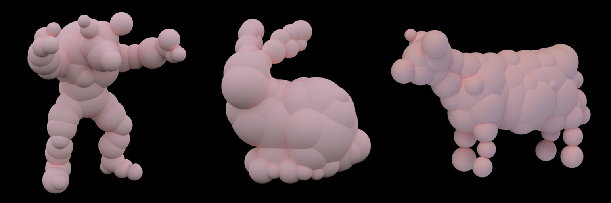

# Sphere Set Approximation

**WORK IN PROGRESS**

Approximate a mesh by bounding it with a set of spheres, which can be used for collision detection, shadowing, etc.



The program requires an original mesh and a simplified manifold version of the mesh, which can be generated from the original mesh using [hjwdzh/Manifold](https://github.com/hjwdzh/Manifold). The original mesh is used for surface constraint, while the manifold mesh is used for volume constraint & redundant volume optimization.

You may try with different seeds to get better result.

## Usage

```bash
cd src
make
./main -i ../armadillo.obj -m ../armadillo_manifold.obj -n 64
```

It outputs to `stdout` and logs to `stderr`.

The algorithm runs quite slow (proportional to number of triangular faces of the manifold).

The manifold must be closed and orientable.

## Algorithm

We use method described in

[*Variational Sphere set Approximation for Solid Objects*](http://dx.doi.org/10.1007/s00371-006-0052-0)

with several minor changes:

- bugfixes SOTV, which in this paper is overestimated in some cases
- provides an analytic algorithm to solve swing volume
- voxel size doesn't have to be manually specified
- better sample quality of surface points
- other minor strategy optimizations

#### paper abstract

We approximate a solid object represented as a triangle mesh by a bounding set of spheres having minimal summed volume outside the object. We show how outside volume for a single sphere can be computed using a simple integration over the object’s triangles. We then minimize the total outside volume over all spheresin the set using a variant of iterative Lloyd clustering which splits the mesh points into sets and bounds each with an outside volume-minimizing sphere. The resulting sphere sets are tighter than those of previous methods. In experiments comparing against a state-of-the-art alternative (adaptive medial axis), our method often requires half or fewer as many spheres to obtain the same error, under a variety of error metrics including total outside volume, shadowing fidelity, and proximity measurement.

#### Optimization steps

1. Fix the centers of spheres. Greedily assign points to them, minimizing SOV
2. Fix the point clusters. Adjust the spheres using Powell's method, minimizing SOV
3. Teleportation: Remove the most redundant sphere. Split the sphere with most SOV
